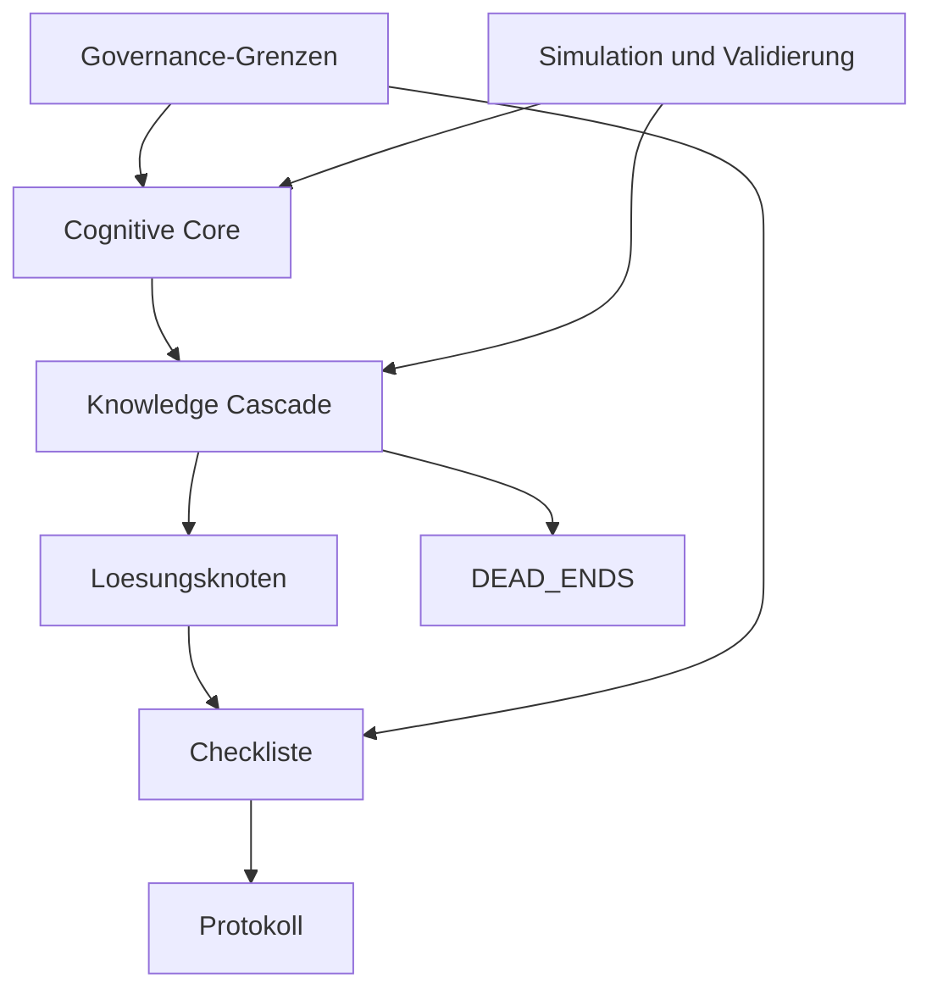
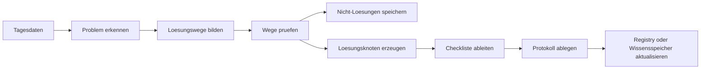
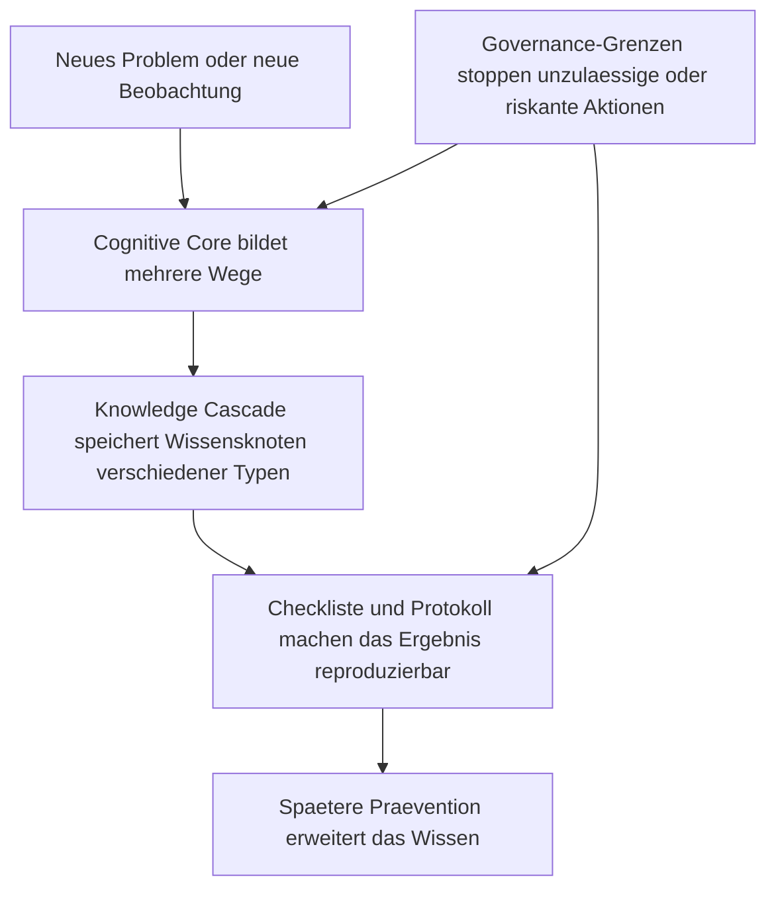

# Governed Cognitive Architecture (GCA) v1.0

**Untertitel:** Eine mehrschichtige Architektur fuer langfristig lernende, nachvollziehbare und governance-gesteuerte KI-Systeme.

**Status:** Konsolidierte Konzeptfassung v1.0 auf Basis des aktuellen Projektstands  
**Zielgruppe:** Innovationsgutachter, Forschungsfoerderer, Professoren, technische Entscheider, Investoren  
**Wichtiger Hinweis:** Dieses Dokument fuehrt vorhandene Inhalte zusammen. Es trennt sauber zwischen bereits beschriebenen Konzepten, geplanten Erweiterungen und Punkten, die noch validiert werden muessen.

---

## 1. Executive Summary

Heutige KI-Systeme koennen viel Wissen verarbeiten, aber sie tun sich schwer mit vier Grundproblemen: Sie verlieren bei langen Problemketten den Kontext, sie speichern immer mehr Daten ohne saubere Verdichtung, sie lernen oft ohne klare Qualitaetskontrolle, und sie koennen ihre Entscheidungen nur begrenzt nachvollziehbar begruenden.

Die Governed Cognitive Architecture, kurz GCA, ist ein Architekturvorschlag fuer KI-Systeme, die nicht nur Antworten erzeugen, sondern Probleme ueber laengere Zeit strukturiert bearbeiten, Wissen verdichten und ihr eigenes Vorgehen kontrollierbar machen. Die Grundidee ist einfach: Rohdaten, Beobachtungen und offene Fragen werden nicht nur gesammelt, sondern in einen geregelten Denk-, Pruef- und Dokumentationsprozess ueberfuehrt. Am Ende stehen nicht nur Antworten, sondern belastbare Loesungsknoten, Checklisten, Protokolle und spaetere Praeventionsmassnahmen.

Das Besondere an GCA ist nicht eine einzelne Funktion, sondern die Kombination eines heute bereits greifbaren Kerns: ein kognitiver Problemloeser erzeugt und prueft mehrere Wege, eine Wissenskaskade verdichtet Rohmaterial zu dauerhaft nutzbaren Artefakten, und harte Freigabegrenzen verhindern, dass autonomes Denken in unkontrolliertes Handeln kippt.

Die Architektur trennt dabei bewusst zwischen Denken und Handeln. GCA darf Probleme analysieren, Muster erkennen, Loesungswege pruefen und Dokumentation vorbereiten. Produktive Aenderungen, kritische Konfigurationsschritte oder sicherheitsrelevante Eingriffe duerfen dagegen nur mit menschlicher Freigabe erfolgen. Diese Regel ist bereits im bisherigen Material klar angelegt und gehoert zum Kern der Architektur.

Ein weiterer Unterschied zum Stand der Technik liegt in der Behandlung von Nicht-Loesungen. In vielen heutigen KI-Systemen zaehlt nur das Endergebnis. GCA speichert dagegen auch verworfene Wege als negatives Erfahrungswissen. Dadurch entsteht Orientierung: Das System lernt nicht nur, was funktioniert, sondern auch, was bereits geprueft wurde und warum ein Ansatz verworfen wurde.

Die Validierung der Architektur soll nicht nur theoretisch erfolgen. Bereits vorgesehen ist ein Simulationsprinzip mit bekannten realen Faellen, deren Loesung fuer den Test ausgeblendet wird. Das System muss aus denselben Ausgangsdaten wieder zu einer tragfaehigen Einschaetzung kommen. Erste Testfaelle betreffen Hitzestau im Rack, RAM-Kapazitaetsgrenzen und stoerende Backupfenster.

GCA ist damit kein fertiges Produkt, sondern ein strukturierter Architekturansatz mit klar formuliertem Kern und noch offener wissenschaftlicher und technischer Validierung. Der Innovationsgehalt liegt im heutigen Stand vor allem in der Verbindung von Wissensverdichtung, dokumentierter Nicht-Loesung, kontrollierter Autonomie und simulativer Ueberpruefbarkeit.

---

## 2. Ausgangsproblem

### 2.1 Warum heutige KI-Architekturen nicht ausreichen

Viele heutige KI-Systeme sind stark in der Antworterzeugung, aber schwach in der dauerhaften, kontrollierten Problemverarbeitung.

Typische Probleme sind:

| Problem | Bedeutung fuer die Praxis |
|---|---|
| Kontext-Kollaps | Lange Problemketten werden unpraezise, weil fruehere Zwischenschritte verloren gehen. |
| Wachsende Wissensspeicher ohne Verdichtung | Datenmengen wachsen, aber das System baut daraus nicht automatisch belastbares, strukturiertes Erfahrungswissen auf. |
| Fehlendes Langzeitgedaechtnis | Erkenntnisse aus frueheren Faellen stehen spaeter nicht in nutzbarer Form bereit. |
| Fehlende Governance | Das System kann etwas vorschlagen, aber nicht belastbar zeigen, warum dieser Weg verantwortbar ist. |
| Fehlende Nachvollziehbarkeit | Entscheidungen bleiben zu stark an Einzelausgaben haengen statt an dokumentierten Pruefketten. |
| Vermischung von Wissen und Werten | Fakten, Regeln, Ziele und normative Bewertungen werden nicht sauber getrennt. |
| Lernen ohne Qualitaetskontrolle | Systeme uebernehmen neue Muster, ohne sie streng gegen Fehler, Risiko oder Nebenwirkungen zu pruefen. |

### 2.2 Das Kernproblem in einem Satz

Heutige KI kann oft gut antworten, aber nur begrenzt belastbar, kontrolliert und langfristig aus Erfahrung lernen.

---

## 3. Historische Entwicklung

Dieses Kapitel dokumentiert nicht einfach alte Namen. Es zeigt den Reifeprozess der Architektur.

### 3.1 Ursprung

Der fruehe Ausgangspunkt war das **Gedankenspiel Framework**. Die zentrale Einsicht lautete:

> Tagesprobleme duerfen nicht verloren gehen. Sie muessen in dauerhaft nutzbares Wissen ueberfuehrt werden.

### 3.2 Erste Architekturideen

In einer fruehen Phase wurden drei Leitideen sichtbar:

- **Unterbewusstseinsmodell**: Das System soll ausserhalb der aktiven Arbeitszeit weiterdenken.
- **Wissensverdichtung**: Rohmaterial soll nicht liegen bleiben, sondern geordnet verdichtet werden.
- **Abend-Reasoner**: Eine hochwertige Denk-Instanz soll Ursachen, Wege und Loesungen pruefen.

### 3.3 Uebergangsphase

Danach verdichtete sich das Modell zu klareren Architekturbausteinen:

- **Knowledge Cascade** als Weg vom Rohmaterial zu dauerhaft nutzbaren Artefakten
- **Werterahmen und Freigabegrenzen** als Schutz gegen unkontrollierte Autonomie
- **Governance-Gedanke** als Einsicht, dass Wissen allein nicht reicht

### 3.4 Konsolidierung

Aus diesen Teilideen entstand die **Governed Cognitive Architecture (GCA)** als uebergeordnete Architektur.

Die entscheidende neue Einsicht war:

> Nicht ein einzelner Baustein ist die Innovation, sondern die Verbindung aus Denken, Wissensverdichtung, dokumentierten Nicht-Loesungen, Freigabegrenzen und spaeterer Validierung.

### 3.5 Evolution der Erkenntnisse

| Phase | Neue Erkenntnis |
|---|---|
| Gedankenspiel | Wissen muss dauerhaft erhalten bleiben. |
| Wissensverdichtung | Wissen muss verdichtet werden. |
| DEAD_ENDS | Fehler sind ebenfalls Wissen. |
| Werterahmen und Freigabegrenzen | Lernen und Handeln brauchen Grenzen. |
| Governance-Gedanke | Wissen allein reicht nicht. |
| GCA | Alle Bausteine bilden gemeinsam eine Architektur. |

### 3.6 Aktueller Stand

Die vorliegende Fassung ist **Version 1.0**. Sie zeigt einen konsolidierten Kern und trennt ihn bewusst von spaeteren moeglichen Erweiterungen.

---

## 4. Die Loesung

GCA fuehrt die vorhandenen Projektideen zu einer geregelten Architektur zusammen.

Der Grundablauf lautet:

```text
Rohdaten und Beobachtungen
-> Problem erkennen
-> mehrere Loesungswege bilden
-> Wege pruefen
-> Nicht-Loesungen speichern
-> tragfaehige Loesung ableiten
-> Checkliste und Protokoll erzeugen
-> Wissen verdichten
-> spaetere Entscheidungen verbessern
```

Diese Logik ist bereits im bestehenden Material als Wissenskaskade, Entscheidungsbaum, Loesungsknoten, Checklistenprinzip und Praeventionskreislauf angelegt. GCA macht daraus eine uebergeordnete, gutachtertaugliche Gesamtarchitektur.

### 4.1 Leitidee

GCA soll Tagesprobleme nicht nur dokumentieren, sondern in dauerhaft nutzbares und pruefbares Wissen ueberfuehren.

### 4.2 Zentraler Unterschied

Das System speichert nicht nur erfolgreiche Antworten, sondern auch gepruefte Nicht-Loesungen, Begruendungen, Freigaben und spaetere Praeventionsmassnahmen.

---

## 5. Die Architektur

## 5.1 Kernarchitektur

GCA wird in dieser Fassung bewusst auf den heute belegten Kern begrenzt.



### 5.2 Cognitive Core

Hier findet das eigentliche Denken statt: Problemverstehen, Ursachenanalyse, Planung, Variantenbildung und Problemlosung.

Das vorhandene Material beschreibt diese Ebene bereits konkret:

```text
Problem
-> Weg A
-> Weg B
-> Weg C
-> Bewertung der Wege
-> tragfaehiger Weg oder Eskalation
```

Wichtige Regeln:

| Regel | Funktion |
|---|---|
| Problem nicht umdeuten | Das System muss bedeutungstreu bleiben. |
| Mehrere Wege pruefen | Keine vorschnelle Ein-Wege-Logik. |
| Bis 20 Iterationen weiterdenken | Autonomie nur innerhalb klarer Grenzen. |
| Bei Risiko sofort eskalieren | Sicherheit geht vor Vollautomatik. |

Im bisherigen Material erscheint der frueher so genannte "Abend-Reasoner" als konkrete Denk-Instanz dieses Kerns. In GCA ist er kein Dachbegriff mehr, sondern hoechstens eine moegliche Unterkomponente.

### 5.3 Knowledge Cascade

Die Knowledge Cascade verdichtet Rohmaterial zu dauerhaft nutzbarem Wissen.



Die vorhandenen Quellen nennen dafuer bereits mehrere Bausteine. Fuer die runde GCA-Fassung gilt dabei folgende innere Logik:

```text
Erkenntnis
-> Wissensknoten
-> Typ
-> Loesungsknoten / Fakt / HYPOTHESIS / DEAD_END / Checkliste / Protokoll
```

`Wissensknoten` bleibt damit der interne Oberbegriff. Nach aussen kann weiterhin vor allem mit `Loesungsknoten` gearbeitet werden.

Die aktiven Kernbausteine sind:

| Baustein | Zweck |
|---|---|
| DAILY_DUMP | Rohmaterial des Tages |
| Wissensknoten | interner Oberbegriff fuer strukturierte Erkenntnisse |
| HYPOTHESIS | gepruefter Denkweg im Prozess |
| DEAD_ENDS | verworfene Wege als gespeichertes Negativwissen |
| Loesungsknoten | Speichert tragfaehige Loesungswege mit Begruendung |
| Checklisten | Ueberfuehren Loesung in reproduzierbare Handlung |
| Protokolle | Dokumentieren die reale Durchfuehrung |
| Wartungsplaene | Fuehren von Einzelfall zu Praevention |
| Registry-Anbindung | Macht Wissen dauerhaft auffindbar |

Nicht Teil des festen Kerns dieser Fassung sind Begriffe wie Baseline, Pointer, Subprocess oder atomare Commits. Sie werden vorerst nicht als Architekturbausteine gefuehrt.

Historie ist kein eigener Baustein. Sie entsteht aus DAILY_DUMP, HYPOTHESIS, DEAD_ENDS, Loesungsknoten, Checklisten und Protokollen.

### 5.4 Governance-Grenzen

Ein eigenes Governance-Engine-Modell ist in dieser Fassung noch nicht Teil der Kernarchitektur. Belegt sind heute harte Governance-Grenzen:

| Bereits greifbar | Sicherheitsfunktion |
|---|---|
| Denken autonom, Handeln kontrolliert | Trennung von Analyse und Eingriff |
| Menschliche Freigabe | Absicherung kritischer Aenderungen |
| Sicherheitsregeln nicht autonom veraenderbar | Schutz gegen Selbstentgrenzung |
| Protokollpflicht | Nachvollziehbarkeit und spaetere Pruefung |
| Eskalation bei Risiko | Fruehes Bremsen bei Unsicherheit |

Diese Begrenzungen gehoeren zum Kern. Ein ausformulierter Werterahmen, eine philosophische Bewertungslogik oder eine technische Security-Unterarchitektur gehoeren in dieser Fassung noch nicht dazu.

### 5.5 Simulation und Validierung

Simulation ist Teil des belegten Kerns, weil sie im Material bereits als konkretes Pruefverfahren beschrieben wird.

| Bereits angelegt | Bedeutung |
|---|---|
| Simulation gegen bekannte Faelle | Fruehe Form einer Qualitaetspruefung |
| Lueckenliste | Dokumentiert, was dem System fehlt |
| Statuswerte wie BESTANDEN oder DATEN FEHLEN | Einfache Bewertungslogik |

---

## 6. Zusammenspiel der Ebenen

### 6.1 Ablauf in einfacher Form



### 6.2 Beispielhafte Leselogik fuer den Gutachter

| Schritt | Frage | Zustaendiger Kernbereich |
|---|---|---|
| Problem | Was ist passiert? | Cognitive Core |
| Loesung | Welche Wege gibt es? | Cognitive Core |
| Nutzen | Welcher Weg ist tragfaehig? | Knowledge Cascade plus Governance-Grenzen |
| Beweisbarkeit | Wie wird das dokumentiert und spaeter geprueft? | Checkliste, Protokoll und Simulation |
| Offene Punkte | Was bleibt unsicher oder unbewiesen? | Simulation und Lueckenliste |

### 6.3 Ein praktisches Mini-Beispiel

Beim Testfall "Rack-Hitzestau" koennte das Zusammenspiel so aussehen:

```text
Messwerte zeigen Temperaturanstieg von unten nach oben
-> Cognitive Core bildet Ursachenhypothesen
-> HYPOTHESIS werden geprueft
-> unpassende Wege werden als DEAD_ENDS gespeichert
-> tragfaehige Hypothese fuehrt zu Loesungsknoten
-> Checkliste, Umsetzung und Protokollierung folgen
-> der Fall bleibt ueber seine Artefakte spaeter nutzbar
```

---

## 7. Innovation

Die Innovation liegt nicht in einem einzelnen Baustein, sondern in der Kombination aus:

| Kombinationsmerkmal | Warum es relevant ist |
|---|---|
| Trennung von Denken und produktiver Handlung | Macht Vorschlaege kontrollierbar und freigabefaehig. |
| Speicherung von DEAD_ENDS | Erzeugt negatives Erfahrungswissen statt blosser Antwortsammlung. |
| Loesungsknoten mit Checkliste und Protokoll | Ueberfuehrt Denken in reproduzierbare Praxis. |
| Praeventionskreislauf | Einzelprobleme werden zu langfristiger Systemverbesserung. |
| Simulation gegen bekannte Faelle | Erlaubt fruehe Validierung der Architektur ohne sofortigen Produktiveinsatz. |

Sachlich formuliert:

GCA ist kein klassischer Chatbot und auch keine reine Wissensdatenbank. Es ist eine Architektur fuer geregeltes, dokumentiertes und spaeter ueberpruefbares maschinelles Problembearbeiten.

---

## 8. Vorteile

### 8.1 Technische Vorteile

| Vorteil | Nutzen |
|---|---|
| Strukturierte Mehrwege-Pruefung | Weniger vorschnelle Einzelloesungen |
| Speicherung negativer Erkenntnisse | Weniger Wiederholung bekannter Sackgassen |
| Wissensverdichtung | Weniger Verlust von Erfahrungswissen |
| Trennung von Denken und Handeln | Hoehere Betriebssicherheit |

### 8.2 Wissenschaftliche Vorteile

| Vorteil | Nutzen |
|---|---|
| Architektur mit expliziten Ebenen | Bessere Forschungs- und Bewertbarkeit |
| Dokumentierte Entscheidungswege | Bessere Nachvollziehbarkeit |
| Simulationsprinzip | Frueher empirischer Vergleich moeglich |
| Offen dokumentierte Grenzen | Hoehere Seriositaet der Darstellung |

### 8.3 Praktische Vorteile

| Vorteil | Nutzen |
|---|---|
| Checklisten und Protokolle | Erkenntnisse werden handhabbar |
| Wartungsplaene aus Einzelproblemen | Wiederkehrende Stoerungen sinken |
| Registry-Anbindung | Wissen bleibt auffindbar und wiederverwendbar |
| Freigabeprozess | Passt zu realen Betriebsablaeufen |

### 8.4 Langfristige Vorteile

| Vorteil | Nutzen |
|---|---|
| Aufbau eines belastbaren Gedaechtnisses | Das System wird mit Erfahrung orientierter |
| Erklaerbare Weiterentwicklung | Lernen bleibt beobachtbar statt diffus |
| Governance als fester Bestandteil | Verantwortung bleibt Teil der Architektur |

---

## 9. Grenzen und offener Realitaetsabgleich

Dieses Kapitel ist bewusst direkt formuliert. GCA ist derzeit eine konsolidierte Konzeptarchitektur, kein voll implementiertes Gesamtsystem.

| Offener Punkt | Aktueller Stand |
|---|---|
| Philosophische Ebene | Vorerst nicht Teil der Kernarchitektur |
| Fuenf Grundgesetze | Vorerst nicht Teil der Kernarchitektur |
| Formale Governance Engine | Vorerst nicht Teil der Kernarchitektur |
| Learning Layer | Vorerst nicht Teil der Kernarchitektur |
| Security Layer mit AEGIS, Dual Kernel, Hydra, Canary | Vorerst nicht Teil der Kernarchitektur |
| Langzeitgedaechtnis-Mechanik | Grundlogik vorhanden, technische Detailarchitektur offen |
| Beweis wissenschaftlicher Ueberlegenheit | Noch nicht erbracht, nur als Validierungsziel angelegt |
| Reale Implementierung ausserhalb der Simulation | Noch nicht beschrieben |

Wichtig:

Die derzeit staerksten und am besten belegten Teile des Projekts sind Cognitive Core, Knowledge Cascade, DAILY_DUMP-HYPOTHESIS-DEAD_ENDS-Logik, Loesungsknoten, Governance-Grenzen, Checklisten-Protokoll-Logik, Praeventionskreislauf und simulative Erstvalidierung.

---

## 10. Forschungsfragen

Aus dem aktuellen Stand ergeben sich unter anderem folgende Forschungsfragen:

1. Wie laesst sich Bedeutungstreue ueber viele Iterationen hinweg robust erhalten?
2. Wie kann negatives Erfahrungswissen als DEAD_ENDS dauerhaft gespeichert werden, ohne das System zu ueberladen?
3. Welche Datenstruktur eignet sich fuer Wissensknoten mit den Typen HYPOTHESIS, DEAD_ENDS, Loesungsknoten, Checklisten und Protokolle zugleich?
4. Welche Simulationsfaelle reichen aus, um den Architekturansatz belastbar vorzupruefen?
5. Wo liegt die Grenze zwischen hilfreicher Autonomie und unzulaessiger Selbstentgrenzung?

---

## 11. Roadmap

### 11.1 Kurzfristig

| Ziel | Inhalt |
|---|---|
| Konsolidierung abschliessen | Architekturtext vereinheitlichen und auf den belegten Kern begrenzen |
| Simulationsgrundlage nutzen | Die drei vorhandenen Testfaelle systematisch gegen die Architektur laufen lassen |
| Lueckenliste erstellen | Fehlende Daten und ungeklaerte Kernbegriffe sauber erfassen |

### 11.2 Mittelfristig

| Ziel | Inhalt |
|---|---|
| Kernbegriffe schaerfen | DAILY_DUMP, Wissensknoten, HYPOTHESIS, DEAD_ENDS und Loesungsknoten sauber definieren |
| Registry-Erweiterung strukturieren | Framework-, Pattern- und Solution-Knoten sauber verankern |
| Simulationslogik vertiefen | weitere Testfaelle und Bewertungsprotokolle ergaenzen |
| Governance bei Bedarf spaeter ausbauen | nur wenn der Kern empirisch traegt |

### 11.3 Langfristig

| Ziel | Inhalt |
|---|---|
| Reale Implementierung | Architektur aus der Konzept- in die Systemebene ueberfuehren |
| Empirische Validierung | Mehr Faelle, Vergleichsstudien und reproduzierbare Auswertung |
| Zusaetzliche Ebenen nur spaeter pruefen | Philosophie-, Learning- oder Security-Erweiterungen erst nach Kernvalidierung |

---

## 12. Einordnung des aktuellen Projektstands

### 12.1 Bereits ausgearbeitet

| Bereich | Status |
|---|---|
| Cognitive Core | Klar beschrieben |
| Wissenskaskade | Klar beschrieben |
| Mehrwege-Denken und Iterationsregel | Klar beschrieben |
| Bedeutungstreue-Regel | Klar beschrieben |
| Loesungsknoten | Klar beschrieben |
| Checkliste-zu-Protokoll-Logik | Klar beschrieben |
| Praeventions- und Wartungslogik | Klar beschrieben |
| Registry-Anbindung | Als Erweiterungsvorschlag beschrieben |
| Simulationsprinzip | Klar beschrieben |
| Drei Start-Testfaelle | Klar beschrieben |

### 12.2 Geplante Erweiterungen

| Bereich | Status |
|---|---|
| DAILY_DUMP, Wissensknoten, HYPOTHESIS und DEAD_ENDS begrifflich schaerfen | Vorgesehen |
| Weitere Testfaelle und Simulationsprotokolle | Vorgesehen |

### 12.3 Zukuenftig zu validierende Annahmen

| Annahme | Warum sie offen ist |
|---|---|
| Die Architektur fuehrt zu besseren Entscheidungen als heutige Standardansaetze | Noch nicht empirisch gezeigt |
| Nicht-Loesungen verbessern spaetere Problemverarbeitung messbar | Plausibel, aber noch nicht belegt |
| Simulationen reichen als fruehe Validierung aus | Muss im Verfahren selbst nachgewiesen werden |
| DAILY_DUMP, Wissensknoten, HYPOTHESIS und DEAD_ENDS reichen als schlanker Wissenskern aus | Muss sich im Betrieb zeigen |

---

## 13. Schlussbild

GCA beschreibt in dieser Fassung eine Architektur, in der KI nicht nur antwortet, sondern geordnet denkt, Wissen ueber einen festen Kern verdichtet, nachvollziehbar dokumentiert und ihre Handlungsgrenzen nicht selbst aufhebt.

Der aktuelle Projektstand ist stark genug fuer eine ernsthafte Konzeptdarstellung, aber noch nicht stark genug fuer ueberzogene Produktversprechen. Genau darin liegt die Seriositaet dieser Fassung: Sie zeigt einen klaren Innovationskern, ohne die offenen Punkte zu verdecken.
